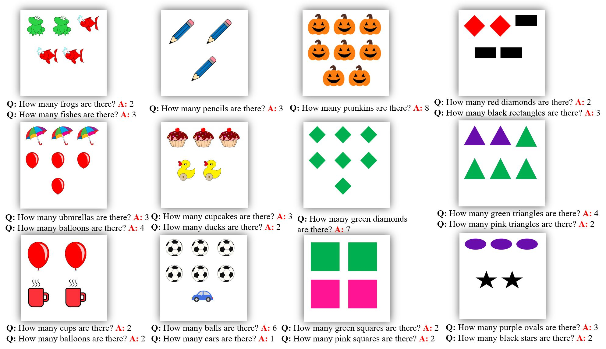

### Publication
Das, B., Sekh, A.A., Majumder, M. et al. Can deep learning solve a preschool image understanding problem?. 
Neural Comput & Applic (2021). Springer
[Link to The Paper](https://doi.org/10.1007/s00521-021-06080-w)

### Abastract
Automatic assessment of learning is a process where the computer system automatically generates test i
tems and evaluates the responses. Image is one of the major media to assess learning capabilities. 
In this article, we have proposed a system with a dataset containing images used to evaluate the kid’s 
ability to answer pictorial questions. The system tests a set of skills such as counting ability, 
color concept, and knowledge of objects and geometric shapes. It utilized a pipeline of RCNN and LSTM 
bridging with an object knowledge layer for generating question–answer pairs and achieved promising results. 
We benchmarked our dataset with state-of-the-art deep learning methods and assessed the performance of 
generating question–answer pairs from a given image. The source code and the dataset are 
available at https://github.com/bidyut2002in/Can-deep-learning-solve-a-preschool-image-understanding-problem
### License

Copyright © 2021 Bidyut Das

The content of this repository is bound by the following licenses:

- The documents and data are licensed under the MIT license.
